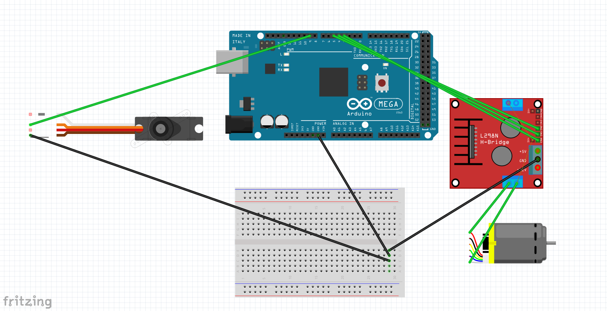
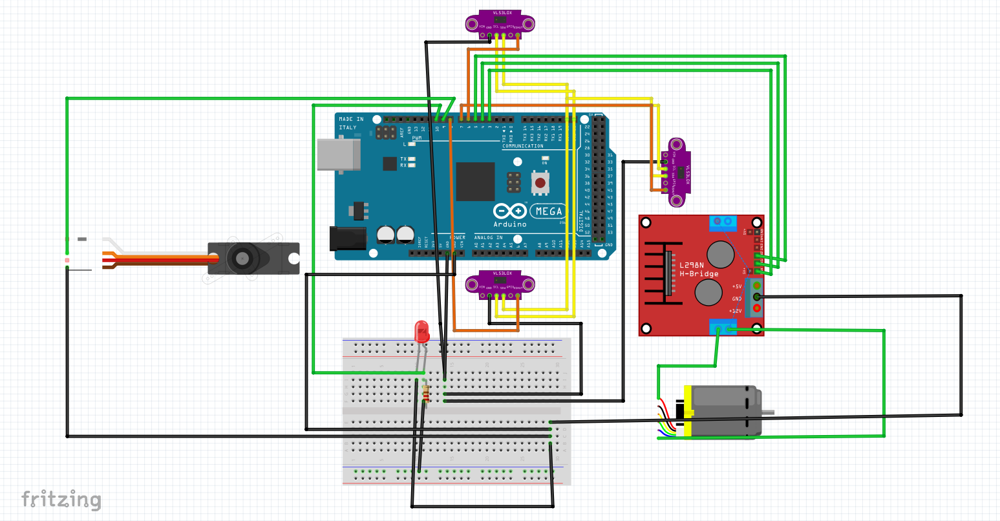

# Hardware documentation 
The robot consists of a wide variety of sensors, motors, and two processing units: a Raspberry Pi 5 and an Arduino Mega. The base is built on a 4WD RC Smart Car Robot Chassis with ann MG996R metal servo and bearing kit, which has been heavily modified to suit our project's requirements. These modifications include custom 3D-printed parts, such as a dedicated camera holder and custom spacers, as well as the replacement of several original components to improve stability, wiring, and sensor integration. All engineering modifications are thoroughly documented and clearly illustrated in the guide provided below.

## List of components
We installed a lot of sensors and other components on the car, here is a list of each of them with a link and some additional notes:
- **Base car** [4WD RC Smart Car Robot Chassis](https://technolab.ps/detail/471)
  - originally 248 x 146 mm, 690 g 695.7 g (including DC and servo motor)
- **Steering servo** [MG996R Metal Servo Bearing Kit](https://technolab.ps/detail/471)
- **DC motor** [DC Gear Motor with Encoder](https://roboticx.ps/product/dc-gear-motor-with-encoder/)
  -  Operating voltage 6V, torque 10 kg*cm max power 3.2A, 210 RPM, 341.2 pulse-per-revolution encoder
- **Single Board Computer** [Raspberry Pi 5 8GB](https://roboticx.ps/product/raspberry-pi-5/?asp_highlight=raspberry&p_asid=3)
  - Operating voltage 5V/5A USB-C, 4 USB ports, 40 pins
- **Microcontroller Arduino Mega 2560** [arduino](https://roboticx.ps/product/arduino-mega-2560-r3-china/)
  - Operating voltage 7-12V, 54 Digital I/O Pins (14 PWM outputs)- 16 Analog Inputs, dimensions: 101.5 x 53.3 mm
- **Motor driver** [L298N](https://roboticx.ps/product/dual-motor-controller-module-l298n/)
  - Max Drive current 2A, control voltage 4.5~5.5V
- **Battery**
  - Bundled with car, 4.2V, 5000mAh,Lithium, [Lithium Ion Battery](https://roboticx.ps/product/lithium-ion-battery-18650-cell-5000mah/)
- **Lithium Battery Charger Module**
  - Maximum current can be 5A , Output voltage 5V
- **Power switch** [SPST](https://roboticx.ps/product/rocker-switch-on-off-spst/)
-  **Laser sensor x3** [VL53L0XV2 Laser](https://roboticx.ps/product/vl53l0xv2-laser-ranging-sensor-time-of-flight-tof/)
  - Dimensions 25 x 10 x 4 mm, 50mm – 1.2m range (default mode), 50mm – 2.2m range (long range mode), frequency 5-33 Hz, accuracy ±2cm ,3.3V
- **Camera** [Raspberry Pi Camera Module V2](https://roboticx.ps/product/raspberry-pi-camera-module/?asp_highlight=raspberry&p_asid=3)
  - No built-in color detection algorithm, field of View: 62.2° horizontal 48.8° vertical, up to 90 fps

## Sensors and motors communication protocols
The different communication protocols used between the components of the robot and their hierarchy:
- Computer
  - Raspberry Pi `SSH & VNC & micro-HDMI `
    - Ardunio Maga `USB `
      - DC Motor with endcoder `Interrupt`
      - Motor driver `PWM` 2x`Digital`
      - Servo `PWM`
      - 3x VL53L0X Sensor `I2C` + `Digital Output (XSHUT)`
  - Camera `CSI-2`

## Design and 3D Printing Of Parts and Assembly Instructions
All parts were specifically designed for the competition using SolidWorks  and printed on () printers using a slicer. The files were exported in (.stl) format for 3D printing, and the material used was (), You can view the designs of all parts in SLDASM and SLDPRT formats [here](/models/Solid_Works_3D_Drawings) ,we drilled and adjusted all the parts ourselves in the engineering workshops at the university.

### 1. Stage one: Printing parts to verify the robot’s ability to move in a straight linear path without deviation.
  In this stage, we designed two planned parts (Front pen holder & Rear pen holder) to hold two pens, aiming to verify the robot’s correct movement and to detect any deviation in the servo motor’s motion in order to program it accurately. The first part is fixed at the front of the robot, and the second at its end, precisely at the center, to measure the accuracy of the path and the amount of deviation.
  
  After printing the holder, we took it to the engineering workshops at the university for drilling and making some necessary modifications
  
  
### 2. Stage two: Designing a movable battery holder (slider)
  It is a retractable drawer mechanism engineered to securely house the batteries and their dedicated charging cradle. The design ensures ease of access for battery replacement and maintenance, while maintaining structural integrity and efficient use of internal space.
  
  The slider was modified in the workshop by filing it down and shortening certain parts to precisely match our intended specifications.
  

### 3. Stage three:

## Assembly
We encountered several challenges during the assembly and planning process, but we are very proud of the work we have accomplished. If you have any questions or encounter any issues, please don't hesitate to contact us at ramanajjar25@gmail.com(Rama) or ahmadabubaker199@gmail.com(Ahmad) through any preferred method.

## Wiring diagrams and details
### 1. Adjusting the servo motor angle  
[Wiring](/schemes/wiring_1.fzz)

#### Wiring details at this stage
**DC Motor via L298N Module**  
(Connected to pins 3, 4, and 5)  
L298N to Arduino Mega:
- IN1 → Pin 4 (controls motor direction)
- IN2 → Pin 5 (controls motor direction)
- ENA → Pin 3 (PWM pin, controls motor speed)

L298N Power:
- OUT1 & OUT2 → Connect to DC motor wires
- 12V / VCC → Connect to external power supply (6V–12V battery)
- GND → Connect to Arduino GND
- 5V (if jumper is present) → Optional; powers logic (you can use it if your battery is strong enough)

---
**Servo Motor (Steering)**  
(Connected to pin 9)  
Servo Motor to Arduino Mega:
- Signal (usually orange or yellow) → Pin 9
- VCC (red) → External 5V–6V power source
- GND (brown/black) → Connect to common GND with Arduino

Note: Servo motors need a separate power supply if they draw significant current. Always connect the grounds together (Arduino GND and power source GND).

---
### 2. Connecting Arduino Mega with DC Motor Encoder and Servo Motor 
[Wiring diagram](/schemes/test_1_wiring.fzz)

#### Wiring details at this stage
**L298N Motor Driver to Arduino Mega**
- OUT1 → Red wire of the DC motor
- OUT2 → White wire of the DC motor
- ENA → Pin 3 on Arduino Mega (PWM control)
- IN1 → Pin 4 on Arduino Mega
- IN2 → Pin 5 on Arduino Mega
- GND → GND (to Arduino GND and battery GND)
- 12V → External power (6V–12V battery)

---
**DC Motor Encoder**
- Green (A signal) → Arduino Mega Pin 18 (Interrupt)
- Yellow (B signal) → Arduino Mega Pin 19 (Interrupt)
- Blue (VCC) → Arduino 5V
- Black (GND) → Arduino GND

---
**Servo Motor to Arduino Mega**
- Signal (Orange) → Pin 9 on Arduino Mega
- VCC (Red) → External 5V–6V power source 
- GND (Brown) → Common GND (Arduino GND + battery GND)

---
**Power Connections**
- DC Motor → Powered by external source (6V–12V) through L298N
- Servo Motor → Separate regulated 5V–6V source (e.g., 2S LiPo with voltage regulator)
- Arduino Mega → Powered via USB or VIN (7V–12V regulated input)

### 3. Connecting 3x VL53L0X Sensors and red LED
[Wiring diagram](/schemes/sensors_wiring.fzz)

#### Wiring details at this stage
**Left VL53L0X Sensor**
- VIN → 5V
- GND → GND
- SDA → Arduino Mega Pin 20
- SCL → Arduino Mega Pin 21
- XSHUT → Arduino Mega Pin 6
---
**Front VL53L0X Sensor**
- VIN → 5V
- GND → GND
- SDA → Arduino Mega Pin 20
- SCL → Arduino Mega Pin 21
- XSHUT → Arduino Mega Pin 7
---
**Right VL53L0X Sensor**
- VIN → 5V
- GND → GND
- SDA → Arduino Mega Pin 20
- SCL → Arduino Mega Pin 21
- XSHUT → Arduino Mega Pin 8
---
**Red LED**
- Anode (long leg) → Arduino Pin 10 (with a 220Ω resistor in series)
- Cathode (short leg) → GND (common ground with Arduino)

## Power
## Mechanical methods
workshop details will be here
## Conclusion

  
  

