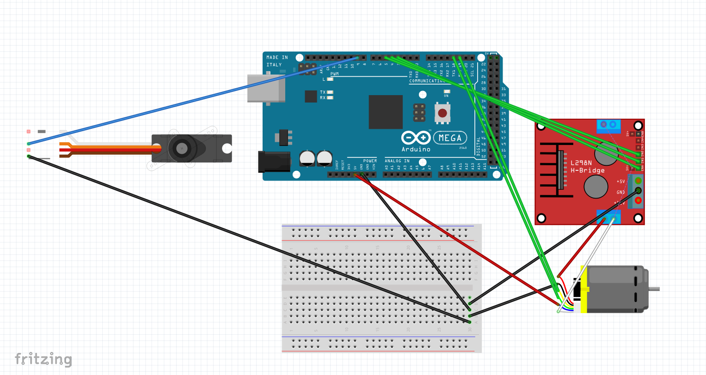

# Software documentation 
This document aims to present all the software solutions we have developed—whether through experiments, testing, or iterative development—leading up to the final software implementation. It also outlines the logic and methodology we used to analyze and solve the project challenges by breaking them down into their simplest components.

The system relies primarily on the Raspberry Pi 5, which functions as the "brain" of the robot. It is mainly responsible for analyzing and processing images captured by the camera, utilizing Computer Vision (CV) techniques, as well as Machine Learning (ML) and Artificial Intelligence (AI) to enable the robot to make intelligent decisions based on visual and environmental data.

## Sensors and motors communication protocols
The different communication protocols used between the components of the robot and their hierarchy:
- Computer
  - Raspberry Pi `SSH & VNC & micro-HDMI `
    - Ardunio Maga ` `
      - DC Motor with endcoder `Interrupt`
      - Motor driver `PWM` 2x`Digital`
      - Servo `PWM`
      - 2x VL53L0X Sensor `I2C` + `Digital Output (XSHUT)`
      - LiDAR ` `
    - Camera `USB`

## Programming computer & Code editor
This can be either a laptop or a PC. We tested everything on a laptop running Windows 11.We used Visual Studio Code [VScode](https://code.visualstudio.com/download), we used several extinstions like :[Python](https://marketplace.visualstudio.com/items?itemName=ms-python.python), [Ardunio](https://marketplace.visualstudio.com/items?itemName=lintangwisesa.arduino),[Ardunio](https://marketplace.visualstudio.com/items?itemName=moozzyk.Arduino), [Java](https://marketplace.visualstudio.com/items?itemName=SonderMX.java-kits)

## Arduino Mega
The [Arduino Integrated Development Environment](https://www.arduino.cc/en/software/)  was our choice to develop our first stage (testing code) files were in**file.ino** extinstion. In later stages we moved into VS code.

## Raspberry Pi 5
### Setup
The Raspberry Pi 5 should have Raspberry Pi OS 64 bit downloaded. You will need to install a few Python libraries using the **`pip`** tool. Pip most likely got installed along with Python but just in case it can be downloaded [here](https://pip.pypa.io/en/stable/installation/).
### Installing libraries
- `pip install rpi-lgpio`
  - **GPIO** pin manager library for Raspberry Pi 5
- `pip install serial`
  - **Serial** communication library
- `pip install smbus2`
  - **I2C** communication library
- `pip install rpi-TM1638`
  - [TMBoard](https://thilaire.github.io/missionBoard/TM163x/) panel library
  
If you successfully install the libraries but still receive a module not found error try replacing the `pip` keyword with `pip3` or `pip3.12`.

## Testing Code (Stage 1)
At this stage, we developed an experimental code based on the basic wiring, with the main goal of testing all wheels, motors, and controllers. This stage was divided into three main parts:

### 1. Adjusting the servo motor angle
During this process, the center angle was set to 90 degrees, with a deviation range of ±10 degrees [servo_test_code](\WRO2025-FE-CanaaniBots\src\servo_test_code.java) [wiring_1](\WRO2025-FE-CanaaniBots\src\wiring_1.fzz).

  

#### Wiring details at this stage 
DC Motor via L298N Module
(Connected to pins 3, 4, and 5)
L298N to Arduino Mega:
- IN1 → Pin 4 (controls motor direction)
-	IN2 → Pin 5 (controls motor direction)
-	ENA → Pin 3 (PWM pin, controls motor speed)
L298N Power:
-	OUT1 & OUT2 → Connect to DC motor wires
-	12V / VCC → Connect to external power supply (6V–12V battery)
-	GND → Connect to Arduino GND
-	5V (if jumper is present) → Optional; powers logic (you can use it if your battery is strong enough)
________________________________________
 Servo Motor (Steering)
(Connected to pin 9)
 Servo Motor to Arduino Mega:
-	Signal (usually orange or yellow) → Pin 9
-	VCC (red) → External 5V–6V power source
-	GND (brown/black) → Connect to common GND with Arduino
 Note : Servo motors need a separate power supply if they draw significant current. Always connect the grounds together (Arduino GND and power source GND).

 #### Classes
`DCMotor` 
 to control the motor speed and direction.

`Steering` 
to control the servo angle with limits.

`Steering` 
is currently empty — to add automatic or manual control later.

### 2. Working on it simultaneously with the mechanical aspect
The DC motor runs continuously forward, while the servo automatically turns every 5 seconds in a loop: Left → Center → Right → repeat.[Servo test code](\WRO2025-FE-CanaaniBots\src\servo_test_code.java) [Wiring diagram](\WRO2025-FE-CanaaniBots\src\test_1_wiring.fzz).

  

#### Wiring details at this stage 
L298N Motor Driver to Arduino Mega
L298N Pin	Connect To
- OUT1	Red wire of the DC motor
- OUT2	White wire of the DC motor
- ENA	Pin 3 on Arduino Mega (PWM control)
- IN1	Pin 4 on Arduino Mega
- IN2	Pin 5 on Arduino Mega
- GND	GND (to Arduino GND and battery GND)
- 12V	External power (6V–12V battery)
________________________________________
 DC Motor Encoder 
Encoder Wire	Connect To
- Green (A signal)	Arduino Mega Pin 18 (Interrupt)
- Yellow (B signal)	Arduino Mega Pin 19 (Interrupt)
- Blue (VCC)	Arduino 5V
- Black (GND)	Arduino GND
________________________________________
 Servo Motor to Arduino Mega
Servo Wire	Connect To
- Signal (Orange)	Pin 9 on Arduino Mega
- VCC (Red)	External 5V–6V power source 
- GND (Brown)	Common GND (Arduino GND + battery GND)
________________________________________
 Power Connections
-	DC Motor → Powered by external source (6V–12V) through L298N
-	Servo Motor → Separate regulated 5V–6V source (e.g., 2S LiPo with voltage regulator)
-	Arduino Mega → Powered via USB or VIN (7V–12V regulated input)
________________________________________
Pins Summary (Arduino Mega)
Purpose	Pin
- DC Motor ENA (PWM)	Pin 3
- DC Motor IN1	Pin 4
- DC Motor IN2	Pin 5
- Servo Signal	Pin 9
- Encoder A	Pin 18 (optional)
- Encoder B	Pin 19 (optional)

#### Functions
`setup()` 
Initializes motor and servo pins, starts forward movement, centers the servo, and begins Serial communication.

`loop()` 
Repeatedly changes the steering direction every 5 seconds and prints the current state to the Serial Monitor with center angle = 90 , Max to Right = 125, Max to Left = 55.

## Open challenge
## Obstacle challenge

 

## Framework - functions

====

This directory must contain code for control software which is used by the vehicle to participate in the competition and which was developed by the participants.

All artifacts required to resolve dependencies and build the project must be included in this directory as well.